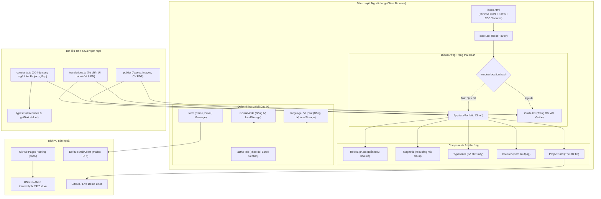
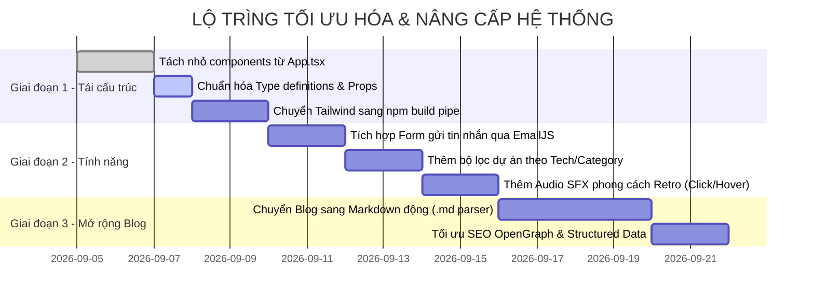

# TÀI LIỆU ĐẶC TẢ KIẾN TRÚC & HƯỚNG DẪN DỰ ÁN TOÀN DIỆN
# (PROJECT MASTER ARCHITECTURE & TECHNICAL SPECIFICATION)

> **Dự án:** Tran Minh Phu - Personal Portfolio (Retro Vietnamese Style)  
> **Chủ sở hữu:** Trần Minh Phú (IT Developer / GSA / UI-UX Enthusiast)  
> **Domain chính thức:** [tranminhphu7425.id.vn](https://tranminhphu7425.id.vn)  
> **Phiên bản:** 1.0.0 (Production Ready)  
> **Ngày cập nhật:** 04/09/2026  

---

## 1. TỔNG QUAN DỰ ÁN (EXECUTIVE SUMMARY)

### 1.1. Tầm nhìn & Mục đích (Project Vision)
**Tran Minh Phu - Portfolio Retro** là trang web hồ sơ năng lực cá nhân (Personal Portfolio Website) được thiết kế theo ngôn ngữ thẩm mỹ **Retro / Vintage Bảng hiệu Việt Nam cổ điển**, kết hợp cùng kỹ thuật giao diện hiện đại (**Modern Web Engineering**) với các hiệu ứng vi tương tác (**Micro-interactions**), vật lý chuyển động (**Spring physics & 3D Tilt**), và khả năng chuyển đổi giao diện Sáng / Tối (**Dark / Light Theme**).

Mục tiêu cốt lõi của dự án:
- **Định vị thương hiệu cá nhân:** Khẳng định hình ảnh của một lập trình viên IT có tư duy logic vững vàng, am hiểu UI/UX và có gu thẩm mỹ độc đáo.
- **Trưng bày sản phẩm & Năng lực:** Giới thiệu các dự án tiêu biểu (Full-stack, Frontend, Backend), kinh nghiệm làm việc, học vấn, chứng chỉ quốc tế và kỹ năng kỹ thuật.
- **Chia sẻ tri thức (Knowledge Base):** Tích hợp phân hệ Blog/Guide hướng dẫn công nghệ thực tế (ví dụ: kích hoạt ưu đãi Google AI Pro).
- **Kênh kết nối & Tuyển dụng:** Cung cấp phương thức liên hệ tức thì, tải CV trực tiếp và liên kết mạng xã hội chuyên nghiệp.

### 1.2. Đối tượng phục vụ mục tiêu (Target Audience)
- **Nhà tuyển dụng / Tech Recruiters / HR:** Đánh giá nhanh hồ sơ, kỹ năng, kinh nghiệm và dự án thực tế.
- **Khách hàng / Đối tác doanh nghiệp:** Tìm kiếm lập trình viên phát triển giải pháp phần mềm, web app.
- **Cộng đồng sinh viên & Lập trình viên:** Tham khảo bài viết công nghệ, chia sẻ tài nguyên và kết nối học tập.

### 1.3. Điểm nổi bật & Trải nghiệm thị giác (Key Highlights)
1. **Phong cách Retro Vintage độc bản:** Sử dụng bảng màu cổ điển (*Cream `#FDF5E6`, Vintage Red `#bc4749`, Forest Green `#386641`, Charcoal Dark `#1a1a1a`*), viền đôi retro (`retro-border`), hiệu ứng đổ bóng khối 3D chữ (`retro-3d-text`), lớp phủ vân giấy cổ (`paper-fibers`) và hạt nhiễu chuyển động (`grain animation`).
2. **Hiệu ứng đồ họa cổ điển (Decorative Overlays):** Hiệu ứng mạng nhện góc bảng (`spider-web`), vết rạn nứt thời gian (`crack-br`, `crack-bl`), và bụi mờ hoài cổ (`dust-overlay`).
3. **Chuyển động & Vi tương tác mượt mà (Framer Motion Engine):**
   - **Magnetic Buttons:** Các nút bấm có lực hút từ tính theo tọa độ chuột.
   - **3D Card Parallax Tilt:** Thẻ dự án nghiêng theo góc di chuyển chuột 3D.
   - **Scroll Progress & Indicator:** Thanh đo tiến độ đọc trang và nút *Scroll to Top* tích hợp vòng SVG đo % cuộn trang.
   - **Typewriter & Number Counter:** Hiệu ứng gõ máy chữ tiêu đề và bộ đếm số động khi cuộn vào tầm nhìn (`InView`).
4. **Kiến trúc Single-Page siêu nhẹ với Hash Routing:** Điều hướng tức thì giữa Portfolio chính và bài viết hướng dẫn (`#guide`) mà không cần nạp lại trang.

---

## 2. TECH STACK & BẢNG THƯ VIỆN SỬ DỤNG

Dự án được xây dựng trên nền tảng Frontend tối tân, chú trọng vào hiệu năng cao, dung lượng tải nhẹ và khả năng tương thích đa thiết bị.

| Phân loại | Công nghệ / Thư viện | Phiên bản | Vai trò & Mục đích sử dụng |
| :--- | :--- | :--- | :--- |
| **Core Framework** | React | `^19.2.4` | Thư viện UI nền tảng để xây dựng component hướng cấu trúc khai báo (Declarative UI). |
| **DOM Renderer** | React DOM | `^19.2.4` | Gắn kết và render ứng dụng React vào DOM thực tế của trình duyệt. |
| **Ngôn ngữ** | TypeScript | `~5.8.2` | Đảm bảo tính an toàn kiểu dữ liệu (Type-Safety), tự động hoàn thành mã (IntelliSense) và giảm thiểu lỗi runtime. |
| **Build Tool & Bundler** | Vite | `^6.2.0` | Công cụ đóng gói mã nguồn siêu tốc với Hot Module Replacement (HMR) và tối ưu hóa file tĩnh khi build. |
| **Vite React Plugin** | `@vitejs/plugin-react` | `^5.0.0` | Hỗ trợ Fast Refresh và biên dịch JSX/TSX thông qua Babel/SWC. |
| **Animation Engine** | Framer Motion | `^12.34.0` | Thư viện xử lý hiệu ứng chuyển động chuyên nghiệp (Spring animations, Gestures, Layout transitions, Scroll hooks). |
| **Iconography** | Lucide React | `^0.564.0` | Bộ biểu tượng SVG sắc nét, đồng bộ phong cách, hỗ trợ tree-shaking triệt để. |
| **Styling & CSS** | Tailwind CSS CDN + Custom CSS | Dynamic (v3.x) | Hệ thống Utility-first CSS kết hợp cấu hình theme Retro tùy chỉnh và hiệu ứng CSS thủ công (Animations, Gradients, Textures). |
| **Typography** | Google Fonts (Be Vietnam Pro) | Webfont | Phông chữ tiếng Việt hiện đại, sắc nét, trọng số đa dạng từ `300` đến `900`. |
| **Deployment / Hosting** | GitHub Pages + Custom Domain | N/A | Hệ thống lưu trữ và triển khai web tĩnh miễn phí, tích hợp tên miền riêng `tranminhphu7425.id.vn` qua file `CNAME`. |

---

## 3. CẤU TRÚC THƯ MỤC DỰ ÁN (PROJECT STRUCTURE)

Dự án tuân theo cấu trúc phẳng hóa tinh gọn (Flat & Modular Architecture), giúp việc truy xuất tài nguyên, chỉnh sửa nội dung và đóng gói diễn ra nhanh chóng.

```text
MyPortfolio/
├── .git/                                # Quản lý mã nguồn Git
├── .gitignore                           # Danh sách loại trừ tệp khỏi Git tracking
├── components/                          # Các React Components tái sử dụng
│   └── RetroSign.tsx                    # Khung biển hiệu Retro với viền hoa văn và họa tiết hoài cổ
├── docs/                                # Thư mục Build Output phục vụ GitHub Pages
│   ├── assets/                          # JS và CSS bundles đã được minify
│   ├── guide/                           # Hình ảnh minh họa bài viết Guide
│   ├── uploads/                         # Avatar, hình dự án và file CV PDF
│   ├── CNAME                            # Tên miền tùy chỉnh: tranminhphu7425.id.vn
│   └── index.html                       # Entry HTML được sinh ra sau khi chạy vite build
├── node_modules/                        # Thư viện npm dependencies
├── public/                              # Thư mục chứa tài nguyên tĩnh nguồn (Static Assets)
│   ├── guide/                           # Ảnh chụp minh họa các bước nhận Google AI Pro
│   │   ├── Coursera-AI-Fundamentals-1024x56.png
│   │   ├── Coursera-Cancel-Subscription-102.png
│   │   ├── Coursera-Credit-Card-1024x654.png
│   │   ├── Redeem-your-Google-AI-Pro-trial (1).png
│   │   ├── Redeem-your-Google-AI-Pro-trial (2).png
│   │   ├── Redeem-your-Google-AI-Pro-trial (3).png
│   │   └── Redeem-your-Google-AI-Pro-trial.png
│   └── uploads/                         # Tài nguyên cá nhân
│       ├── GraphBuilder.png             # Ảnh preview dự án Graph Builder
│       ├── MeetingRoomBookingSystem.png # Ảnh preview dự án Đặt phòng họp
│       ├── QuizUniverse.png             # Ảnh preview dự án Quiz Universe
│       ├── SportBooking.png             # Ảnh preview dự án Sport Booking
│       ├── TranMinhPhu's CV.pdf         # File hồ sơ năng lực PDF tải về
│       └── gsa-vn26-1fd3a643-0f49-4fa2-9f74-ba42982986c2.jpg # Avatar chính thức
├── App.tsx                              # Component trung tâm chứa toàn bộ giao diện Portfolio chính
├── constants.ts                         # Dữ liệu nội dung: Thông tin cá nhân, Dự án, Kỹ năng, Học vấn, Thành tựu
├── Guide.tsx                            # Component bài viết chi tiết hướng dẫn nhận Google AI Pro
├── index.html                           # File HTML gốc (Cấu hình CDN Tailwind, Font chữ, Custom Styles, Keyframes)
├── index.tsx                            # Entry point của ứng dụng (Xử lý Hash Routing #guide và render React)
├── metadata.json                        # Metadata mô tả thông tin ứng dụng
├── package.json                         # Khai báo dependencies, scripts và cấu hình dự án
├── package-lock.json                    # Khóa phiên bản dependencies chi tiết
├── PROJECT_MASTER_GUIDE.md              # [TÀI LIỆU NÀY] Toàn bộ đặc tả kỹ thuật & hướng dẫn dự án
├── tsconfig.json                        # Cấu hình TypeScript compiler
├── translations.ts                     # Từ điển chuỗi giao diện song ngữ Tiếng Việt (VI) & Tiếng Anh (EN)
├── types.ts                            # Khai báo interfaces và kiểu dữ liệu TypeScript (Project, Skill, Exp, Lang)
├── vite.config.ts                       # Cấu hình Vite bundler (Alias, Base URL, build outDir: 'docs')
```

### Chú thích vai trò các tệp trọng yếu:
- **`App.tsx`**: Khối giao diện chính gồm 7 phần (Navbar, Hero, About, Projects, Experience, Blog, Contact, Footer) kèm toàn bộ logic tương tác, đa ngôn ngữ và micro-interactions.
- **`Guide.tsx`**: Khối giao diện chuyên trang tài liệu bài viết, hiển thị nội dung dạng bài báo (Typography Prose) với các bước hướng dẫn trực quan và nút chuyển đổi ngôn ngữ.
- **`translations.ts`**: Từ điển văn bản UI phân tách theo mã ngôn ngữ (`vi`, `en`), phục vụ toàn bộ nhãn navigation, buttons, placeholders, section titles.
- **`constants.ts`**: "Nguồn chân lý" (Single Source of Truth) lưu trữ dữ liệu cá nhân, dự án, kỹ năng, kinh nghiệm và thành tựu với cấu trúc song ngữ `LocalizedString`.
- **`types.ts`**: Khai báo cấu trúc dữ liệu TypeScript (`Language`, `LocalizedString`, `Project`, `Skill`, `Experience`, `Achievement`) và hàm tiện ích `getText`.
- **`vite.config.ts`**: Thiết lập `outDir: 'docs'` để deploy trực tiếp lên nhánh `main` của GitHub Pages với custom domain.

---

## 4. KIẾN TRÚC HỆ THỐNG & LUỒNG DỮ LIỆU (SYSTEM ARCHITECTURE)

### 4.1. Sơ đồ khối tổng thể (Mermaid Architecture Diagram)



### 4.2. Các luồng xử lý chính (Core Data Flows)

#### A. Luồng điều hướng Hash Routing:
1. Trình duyệt tải `index.html` và nạp `index.tsx`.
2. `index.tsx` lắng nghe sự kiện `hashchange` trên đối tượng `window`.
3. Nếu `window.location.hash` chứa chuỗi `#guide`, component `<Guide />` được render độc lập.
4. Ngược lại, component `<App />` (Portfolio chính) được render.
5. Khi người dùng click vào nút *"Quay lại"* trong `<Guide />`, hash chuyển về rỗng/root, màn hình tự động cuộn lên đầu (`window.scrollTo(0,0)`).

#### B. Luồng Quản lý Đa Ngôn Ngữ (Internationalization / i18n Flow):
1. **Khởi tạo:** Khi ứng dụng khởi chạy, state `language` kiểm tra `localStorage.getItem('language')`. Nếu chưa có, mặc định là `'vi'`.
2. **Chuyển đổi (Toggle Switch):** Người dùng tương tác qua nút chuyển đổi `[ VI | EN ]` trên thanh Navigation bar của cả `App.tsx` và `Guide.tsx`.
3. **Phản hồi tức thì (Zero-reload UI Update):**
   - Các nhãn giao diện tĩnh nạp từ `TRANSLATIONS[language]`.
   - Các nội dung động (mô tả dự án, kỹ năng, kinh nghiệm, thành tựu, câu tagline) được phân giải tự động qua hàm `getText(field, language)`.
   - Hiệu ứng máy chữ `Typewriter` tự động xóa chuỗi cũ và gõ lại văn bản theo ngôn ngữ mới.
   - Lưu lựa chọn vào `localStorage.setItem('language', lang)` để duy trì trải nghiệm khi người dùng quay lại.

#### C. Luồng quản lý Giao diện Sáng / Tối (Theme Mode Flow):
1. **Khởi tạo:** Kiểm tra giá trị đã lưu trong `localStorage.getItem('theme')`. Nếu chưa có, kiểm tra qua media query hệ điều hành `prefers-color-scheme: dark`.
2. **Cập nhật:** Khi người dùng click nút đổi theme, state `isDarkMode` đảo chiều.
3. **Hiệu ứng DOM:** Class `.dark` được thêm hoặc gỡ bỏ khỏi thẻ `<html>` (`document.documentElement.classList`), đồng thời lưu trạng thái mới vào `localStorage`.
4. **Hiển thị:** Các class Tailwind `dark:*` và CSS pseudo-classes tương ứng lập tức chuyển đổi màu nền, độ trong suốt của vân rạn nứt (`.crack-br`, `.spider-web`) và độ mờ của bộ lọc nhiễu.

#### D. Luồng phản hồi Tương tác Cuộn & Active Navigation:
1. `useScroll()` từ `framer-motion` liên tục tính toán tỷ lệ cuộn trang (`scrollYProgress`).
2. Thanh tiến trình ở mép trên cùng co giãn theo trục X (`scaleX`) với vật lý lò xo (`useSpring`).
3. Vòng tròn tiến trình của nút *Scroll to Top* biến thiên thuộc tính `clipPath` theo chiều sâu trang.
4. Một Event Listener `scroll` kiểm tra tọa độ `getBoundingClientRect()` của 5 khu vực (`home`, `about`, `projects`, `blog`, `contact`) để làm nổi bật nhãn tương ứng trên thanh Navigation bằng `layoutId="activeNav"`.

#### E. Luồng Gửi Tin nhắn (Contact Form Flow):
1. Người dùng nhập `name`, `email`, `message` vào form liên hệ.
2. Khi submit (`onSubmit`), hàm `handleSubmit` thực hiện:
   - Ngăn chặn hành vi reload mặc định (`e.preventDefault()`).
   - Mã hóa URI an toàn chuỗi tiêu đề và nội dung theo ngôn ngữ hiện tại bằng `encodeURIComponent()`.
   - Mở ứng dụng gửi thư mặc định của thiết bị qua giao thức `mailto:tranminhphu7.4.2005@gmail.com?subject=...&body=...`.

---

## 5. ĐẶC TẢ TÍNH NĂNG CHI TIẾT (FEATURE BREAKDOWN)

### 5.1. Module Giao diện Portfolio Chính (`App.tsx`)

#### 1. Header & Dynamic Navigation
- **Nhận diện thương hiệu:** Tiêu đề "PHU'S PORTFOLIO" với hiệu ứng 3D Retro Shadow, click để cuộn mượt về đầu trang.
- **Desktop Navigation Bar:** Các mục `Trang chủ` / `Home`, `Về tôi` / `About`, `Dự án` / `Projects`, `Blog`, `Liên hệ` / `Contact`. Có thanh chỉ báo vị trí hiện tại (Active Tab Pill) trượt linh hoạt.
- **Bilingual Language Switcher:** Nút chuyển đổi ngôn ngữ song ngữ Tiếng Việt `VI` và Tiếng Anh `EN` phong cách Retro Segmented Pill, lưu cấu hình vào `localStorage`.
- **Dark Mode Switcher:** Nút chuyển đổi giao diện bọc hiệu ứng từ tính (Magnetic), icon Mặt trời/Mặt trăng xoay 90 độ khi xuất hiện (`AnimatePresence`).
- **Nút tải CV nhanh:** Nút tải file `TranMinhPhu's CV.pdf` nổi bật với icon Download.

#### 2. Hero Section (Màn hình chính)
- **Retro Signboard Khổng lồ:** Bao bọc toàn bộ thông tin giới thiệu trong khung biển hiệu hoài cổ có vân giấy, hoa văn 4 góc.
- **Avatar 3D Interactive:** Ảnh đại diện tròn có viền cổ điển, hiệu ứng mạng nhện góc phải trên (`spider-web-tr`), chuyển đổi từ thang độ xám (grayscale) sang màu tự nhiên kèm phóng to khi hover.
- **Typography 3D:** Tên "TRẦN MINH PHÚ" in đậm kích thước lớn, đổ bóng 3 tầng màu Retro Red.
- **Hiệu ứng Máy chữ (Typewriter):** Tự động gõ từng ký tự câu châm ngôn định hướng bản thân kèm con trỏ nhấp nháy màu đỏ.
- **Call-To-Actions (CTAs):** Nút *"Tuyển dụng tôi"* (cuộn mượt tới mục liên hệ) và nút *"GitHub"* (mở profile GitHub).

#### 3. About Section (Hành trình & Năng lực)
- **Tường thuật câu chuyện:** Giới thiệu quá trình học tập tại ĐH Cần Thơ và định hướng phát triển bản thân.
- **Bộ đếm thành tích động (Counter):** Tự động nhảy số từ 0 đến `4` (Năm học tập) và `4+` (Dự án hoàn thiện) ngay khi cuộn vào khung nhìn.
- **Bảng kỹ năng chuyên môn (Skills Matrix):** Hiển thị danh sách kỹ năng kỹ thuật (PHP, ReactJS, Spring Boot, NodeJS, TypeScript) và kỹ năng mềm, có hiệu ứng nghiêng ngẫu nhiên khi hover.
- **Bảng thành tựu & Chứng chỉ (Achievements):** Nổi bật với danh hiệu cao quý **Top 5 GSA Xuất Sắc Toàn Quốc - Danh Hiệu Trailblazer** (Google Student Ambassador Program) cùng các chứng chỉ uy tín từ Google và Google Cloud.

#### 4. Projects Section (Showcase Dự án)
- **Lưới hiển thị 3D Parallax:** Mỗi thẻ dự án áp dụng thuật toán `useTransform` tính toán theo tọa độ chuột để tạo góc nghiêng 3D thực tế (`rotateX`, `rotateY`).
- **Texture ngẫu nhiên theo Index:** Thẻ thứ nhất gắn vết nứt (`crack-br`), thẻ thứ hai gắn mạng nhện (`spider-web-tl`).
- **Tương tác xem nhanh:** Khi di chuột vào ảnh dự án, lớp phủ gradient tối xuất hiện để lộ 2 nút truy cập nhanh: *Live Demo* và *Source Code GitHub* được bọc hiệu ứng từ tính.
- **Công nghệ sử dụng:** Badges gắn thẻ từng công nghệ (React, TypeScript, Spring Boot, PHP, Bootstrap, v.v.).

#### 5. Experience Section (Kinh nghiệm & Dòng thời gian)
- **Biển hiệu tiêu đề Retro:** Sử dụng biến thể `variant="secondary"` (nền đỏ chữ kem).
- **Trục thời gian tương tác (Vertical Timeline):** Đường kẻ dọc chuyển màu đỏ sinh động đồng bộ theo tỷ lệ cuộn trang (`scrollYProgress`).
- **Các mốc sự kiện:**
  - *Đại học Cần Thơ (2021 - 2025):* Sinh viên chuyên ngành Công nghệ thông tin.
  - *Google Student Ambassador Program (Hoàn thành nhiệm kỳ):* Đại sứ Sinh viên Google với thành tích **Top 5 GSA xuất sắc nhất toàn quốc**, vinh danh danh hiệu **Trailblazer**, tích hợp khung ảnh Polaroid kỷ niệm và danh sách dấu ấn nổi bật.

#### 6. Blog & Tri thức (Knowledge Base)
- **Danh sách bài viết:** Thẻ bài viết đánh số thứ tự phong cách tạp chí hoài cổ (`01`, `02`).
- **Bài viết nội bộ:** Hướng dẫn nhận 3 tháng Google AI Pro (dẫn đến `#guide`).
- **Bài viết mở rộng:** Kênh blog Facebook công nghệ (mở tab mới).

#### 7. Contact Section (Khu vực Liên hệ)
- **Thông tin liên lạc trực tiếp:** Thẻ Email và Số điện thoại với icon xoay động khi hover.
- **Biểu tượng Mạng xã hội:** Các nút GitHub, Facebook với lực hút từ tính.
- **Form liên hệ tương tác:** Ô nhập danh tính, email và lời nhắn được thiết kế chuẩn retro border, liên kết trực tiếp với email client.
- **Dòng chữ nền chạy vô tận (Infinite Marquee Text):** Dòng chữ typographic mờ khổng lồ trượt liên tục ở background.

#### 8. Footer & Floating Actions
- **Monogram Logo P-H-U:** 3 khối hộp chữ cái biểu trưng cho tên Phú với hiệu ứng xoay nghiêng tương tác.
- **Nút Scroll to Top:** Nút tròn cố định góc phải màn hình, chỉ xuất hiện khi đã cuộn xuống >50px, hiển thị vòng tròn tiến độ cuộn trang thời gian thực.

---

### 5.2. Module Bài viết Chi tiết (`Guide.tsx`)

- **Thanh điều hướng riêng:** Nút quay lại trang chủ có hiệu ứng trượt sang trái khi hover, tích hợp nút đổi theme Dark/Light độc lập.
- **Header bài báo cao cấp:** Phân loại chuyên mục (*AI & AUTOMATION*, *THỦ THUẬT HAY*), tiêu đề chính nổi bật với huy hiệu nhấp nháy (*Gemini Advanced + 2TB*), ngày đăng và tác giả.
- **Nội dung hướng dẫn 5 bước chuẩn hóa:**
  - *Bước 1:* Đăng ký tài khoản và kích hoạt dùng thử Coursera (7 ngày).
  - *Bước 2:* Tìm và tham gia khóa học Google AI Fundamentals.
  - *Bước 3:* Nhận mã ưu đãi tại Module 2 (Complete labs & Redeem trial).
  - *Bước 4:* Kích hoạt ưu đãi 0đ trên Google Play / Google One.
  - *Bước 5 (Cực kỳ quan trọng):* Hướng dẫn chi tiết hủy tự động gia hạn Coursera và Google One để bảo toàn miễn phí 100%.
- **Hình ảnh minh họa tương tác:** Toàn bộ ảnh chụp thực tế từ giao diện Coursera và Google Pay với viền khung cổ điển, hiệu ứng xoay nhẹ (`rotate-1`, `-rotate-3`) và trở về góc thẳng khi di chuột.

---

### 5.3. Bảng dữ liệu tĩnh chi tiết (`constants.ts`)

```typescript
// Trích xuất cấu trúc dữ liệu thực tế trong dự án
export const EXPERIENCES: Experience[] = [
  {
    company: "Đại học Cần Thơ",
    role: "Sinh Viên CNTT",
    period: "2021 - 2025 (4 năm)",
    description: "Theo học chuyên ngành Công nghệ thông tin, tập trung vào phát triển phần mềm và kiến thức hệ thống."
  },
  {
    company: "Google Student Ambassador Program",
    role: "Đại sứ Sinh viên Google (GSA)",
    period: "Hoàn thành nhiệm kỳ",
    description: "Đại diện cho Google tại trường đại học, tiên phong tổ chức các sự kiện công nghệ, workshop AI và Google Workspace. Kết thúc chương trình với thành tích xuất sắc và nhận danh hiệu cao quý nhất.",
    badge: "TOP 5 GSA XUẤT SẮC • TRAILBLAZER",
    images: ["uploads/gsa-vn26-1fd3a643-0f49-4fa2-9f74-ba42982986c2.jpg"],
    highlights: [
      "Top 5 Google Student Ambassador (GSA) xuất sắc nhất toàn quốc",
      "Vinh danh đạt danh hiệu 'Trailblazer' của chương trình",
      "Truyền cảm hứng và lan tỏa công nghệ Google & AI đến cộng đồng sinh viên"
    ]
  }
];

export const ACHIEVEMENTS: Achievement[] = [
  { 
    title: "Top 5 GSA Xuất Sắc Toàn Quốc - Danh Hiệu Trailblazer", 
    issuer: "Google Student Ambassador Program",
    badge: "TOP 5 TRAILBLAZER",
    highlight: true 
  },
  { title: "Google UX Design Professional Certificate", issuer: "Google" },
  { title: "Gemini Certified Student", issuer: "Google Cloud" }
];
```

---

## 6. HƯỚNG DẪN CÀI ĐẶT & TRIỂN KHAI (SETUP & DEPLOYMENT GUIDE)

### 6.1. Yêu cầu môi trường (Prerequisites)
- **Node.js:** Phiên bản `>= 18.0.0` (Khuyến nghị Node LTS `20.x` hoặc `22.x`).
- **Package Manager:** `npm` (đi kèm Node) hoặc `pnpm` / `yarn`.
- **Hệ điều hành:** Windows, macOS hoặc Linux.

### 6.2. Cài đặt môi trường phát triển (Local Development)

1. **Clone mã nguồn từ GitHub:**
   ```bash
   git clone https://github.com/tranminhphu7425/MyPortfolio.git
   cd MyPortfolio
   ```

2. **Cài đặt các gói phụ thuộc (Dependencies):**
   ```bash
   npm install
   ```

3. **Khởi chạy máy chủ phát triển (Dev Server):**
   ```bash
   npm run dev
   ```
   Mở trình duyệt và truy cập: `http://localhost:3000` (hoặc cổng hiển thị trên terminal).

---

### 6.3. Đóng gói & Triển khai (Build & Production Deployment)

Dự án được cấu hình sẵn trong `vite.config.ts` để xuất bản phẩm trực tiếp vào thư mục `docs/`:

```typescript
// vite.config.ts
export default defineConfig({
  base: '/',
  build: {
    outDir: 'docs' // Đóng gói trực tiếp vào docs để GitHub Pages phục vụ
  },
  // ...
});
```

#### Quy trình xuất bản cập nhật mới:
1. **Thực hiện build mã nguồn:**
   ```bash
   npm run build
   ```
   Lệnh này sẽ biên dịch toàn bộ TypeScript, tối ưu hóa CSS/JS và đưa toàn bộ assets vào thư mục `docs/`.

2. **Kiểm tra bản build cục bộ (Optional Preview):**
   ```bash
   npm run preview
   ```

3. **Commit và đẩy lên GitHub:**
   ```bash
   git add .
   git commit -m "feat: cap nhat noi dung va build portfolio"
   git push origin main
   ```

4. **Cấu hình trên GitHub Repository Settings:**
   - Vào tab **Settings** > mục **Pages**.
   - Tại phần **Build and deployment** > **Source**: Chọn `Deploy from a branch`.
   - **Branch**: Chọn `main` và thư mục chọn `/docs`.
   - **Custom domain**: Nhập `tranminhphu7425.id.vn` (File `CNAME` trong thư mục `docs/` sẽ tự động duy trì cấu hình này).
   - Tích chọn **Enforce HTTPS**.

---

## 7. ĐÁNH GIÁ CODEBASE & ĐỀ XUẤT NÂNG CẤP (AUDIT & ROADMAP)

### 7.1. Đánh giá Điểm mạnh (Strengths)
1. **Thiết kế xuất sắc & Nhận diện độc bản:** Phong cách Retro Việt Nam kết hợp micro-interactions giúp trang web hoàn toàn khác biệt so với các template danh mục thông thường.
2. **Cảm giác tương tác trực quan cao (High Tactile Feel):** Các chi tiết vật lý như nam châm hút chuột, thẻ bài nghiêng 3D, thanh đo cuộn trang và bộ đếm số tạo cảm giác chuyên nghiệp, cao cấp.
3. **Hiệu năng tải trang cực nhanh:** Xây dựng trên Vite 6 và React 19 giúp thời gian nạp ban đầu gần như tức thì, chỉ số First Contentful Paint (FCP) tối ưu.
4. **Không phụ thuộc Backend phức tạp:** Lưu trữ hoàn toàn miễn phí trên GitHub Pages kết hợp DNS riêng giúp vận hành không tốn chi phí server.

---

### 7.2. Các điểm cần hoàn thiện & Nợ kỹ thuật (Technical Debt)

| Vấn đề phát hiện | Chi tiết kỹ thuật | Đánh giá mức độ | Giải pháp đề xuất |
| :--- | :--- | :--- | :--- |
| **Monolithic File (`App.tsx`)** | `App.tsx` có dung lượng ~1000 dòng, chứa đồng thời nhiều sub-components (`Magnetic`, `Typewriter`, `Counter`, `ProjectCard`) và các section. | 🟡 Trung bình (Khó bảo trì) | Tách thành các file độc lập trong thư mục `components/ui/` và `components/sections/`. |
| **Cơ chế gửi thư thủ công** | Form liên hệ hiện đang dùng liên kết `mailto:`, phụ thuộc vào việc người dùng có cài app Email trên máy hay không. | 🟡 Trung bình (Trải nghiệm UX) | Tích hợp dịch vụ Backendless Email API miễn phí như **EmailJS**, **Web3Forms** hoặc **Resend**. |
| **Tailwind CSS qua CDN** | File `index.html` đang nạp Tailwind qua `<script src="https://cdn.tailwindcss.com">` song song với `vite.config.ts`. | 🟡 Trung bình (Hiệu năng Build) | Cài đặt Tailwind CSS qua npm (`tailwindcss`, `postcss`, `autoprefixer`) để Vite tự purge CSS thừa khi build. |
| **TypeScript Prop Warning** | Component `RetroSign.tsx` nhận prop `noneRow` nhưng chưa định nghĩa trong `RetroSignProps`. | 🟢 Nhẹ (Type Safety) | Bổ sung `noneRow?: boolean;` vào interface `RetroSignProps`. |
| **Key Prop Warning trên ProjectCard** | Trong `App.tsx`, `ProjectCard` được truyền cả prop `key` bên trong định nghĩa tham số. | 🟢 Nhẹ (Console Warning) | Xóa tham số `key` khỏi component parameters (chỉ để `key` ở vị trí JSX render). |

---

### 7.3. Lộ trình phát triển & Nâng cấp đề xuất (Future Roadmap)



---

## 8. TỔNG KẾT

Tài liệu này đóng vai trò là **Bản đặc tả kỹ thuật chuẩn (Master Architecture Blueprint)** cho toàn bộ mã nguồn của dự án **Tran Minh Phu - Portfolio Retro**. Bất kỳ nhà phát triển nào hoặc các hệ thống trợ lý AI tiếp theo đều có thể dựa vào tài liệu này để nắm bắt trọn vẹn bức tranh kiến trúc, luồng nghiệp vụ và tiếp tục phát triển, mở rộng dự án một cách an toàn, chính xác và đồng nhất.
